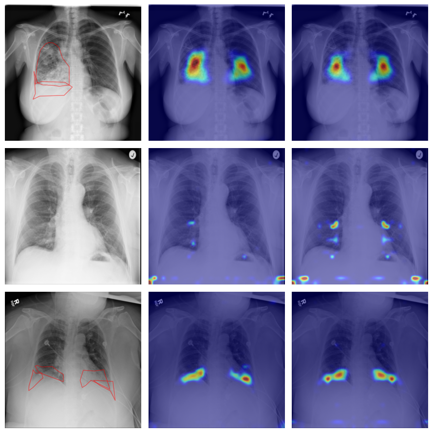

# Improving Disease Detection with Deep Learning by Examining the Symmetrical Features of the Lungs

In this thesis, we analyze chest X-rays by exploiting symmetry features to classify a patient as diseased or healthy. We implement a symmetry-aware deep learning model which utilizes Siamese Network with DenseNet as a feature extractor. Additionally, the model includes a symmetry-aware contrastive learning approach to process the symmetry differences in features. We investigate two different approaches for processing chest X-rays in the deep learning pipeline. The former is processing the entire X-ray scan while the latter is separating the left and right lungs to obtain the prime features of each lung independently. Furthermore, to support the model to exploit symmetry features effectively, we develop an alignment module to make the lung fields symmetric in the vertical line. To evaluate the proposed model, we compare the classification performance of our model with baseline models, CheXNet and Mask R-CNN.

### Visual Outputs

In the following figure, chest X-ray images with ground truth labels, probability maps of our proposed symmetry-aware models (SASN_vanilla and SASN_split), heat maps of the CheXNet baseline model and bounding boxes predictions of the Mask R-CNN baseline model are presented, respectively.


In the following figure, chest X-ray images with ground truth labels and distance maps of our proposed symmetry-aware models, SASN_vanilla and SASN_split, are presented, respectively.



In the following figure, the original image and its aligned form by our proposed alignment module are presented, respectively.


## Setup

1.  Create virtual environment with the following bash script:

   ```bash
   $ ./create_virtual_env.sh
   ```

2.  Download the dataset either manually or automatically: 

   - **Manually**: [This repository](https://github.com/Deepwise-AILab/ChestX-Det-Dataset) shares the ChestX-Det-Dataset. You can manually download train data from [here](http://resource.deepwise.com/ChestX-Det/train_data.zip), test data from [here](http://resource.deepwise.com/ChestX-Det/test_data.zip), train.json file from [here](https://github.com/Deepwise-AILab/ChestX-Det-Dataset/blob/main/ChestX_Det_train.json) and test.json file from [here](https://github.com/Deepwise-AILab/ChestX-Det-Dataset/blob/main/ChestX_Det_test.json).

   - **Automatically**: By running our script with the following command:

     ```bash
     $ ./get_dataset.sh
     ```

## Training and Testing the Models

Activate the virtual environment:

```bash
$ source medai-venv/bin/activate
```

You can see the list of commands with:

```bash
$ python3 scripts/main.py --help
```

After activating the virtual environment, run one of the following command from the repository directory:

```bash
$ python scripts/main.py train-basic-model
$ python scripts/main.py train-chexnet
$ python scripts/main.py train-maskrcnn
$ python scripts/main.py train-sasn-split
$ python scripts/main.py train-sasn-split-without-contrastive
$ python scripts/main.py train-sasn-vanilla
$ python scripts/main.py train-sasn-vanilla-without-contrastive

# After training the model, don't forget to set ckpt_path variable in the respective config file. Models can be found in the logs folder. Alternatively, you can use train-test commands below.
$ python scripts/main.py test-chexnet
$ python scripts/main.py test-sasn-split
$ python scripts/main.py test-sasn-split-without-contrastive
$ python scripts/main.py test-sasn-vanilla
$ python scripts/main.py test-sasn-vanilla-without-contrastive

$ python scripts/main.py train-test-chexnet
$ python scripts/main.py train-test-sasn-split
$ python scripts/main.py train-test-sasn-split-without-contrastive
$ python scripts/main.py train-test-sasn-vanilla
$ python scripts/main.py train-test-sasn-vanilla-without-contrastive
```

Note: This script logs the scores in Tensorboard and Weights&Biases.

## Alignment Module

To compute the alignment parameters, run the following script:

```bash
$ cd src/medai/utils
$ ./align_all_images.sh
```

## Notebooks

| Notebook                                               | Description                                                  |
| ------------------------------------------------------ | ------------------------------------------------------------ |
| [ChestX-Det-Dataset](notebooks/ChestXDetDataset.ipynb) | Inspects the chest X-rays of the subset of the NIH dataset. This subset includes more bounding box and polygon labels of diseases (~3000 images comprising bounding box and polygons) |
| [ChestAlignment](notebooks/ChestAlignment.ipynb)       | Presents the results of the proposed chest alignment module. |
| [Evaluation](notebooks/Evaluation.ipynb)               | Provides the quantitative results of the proposed models and baseline models for various metrics such as AUROC, average precision (AP), F1 score, precision, recall, specificity, ROC curve, Precision-Recall curve. |
| [Heatmaps](notebooks/Heatmaps.ipynb)                   | Provides probability map and heat map outputs of the proposed models. |

## Layout

```
Master's Thesis Repo

├── datasets
│   └── ChestX-Det-Dataset
│       ├── test
│       ├── train
│       ├── ChestX_Det_test.json
│       └── ChestX_Det_train.json
│
├── notebooks
│   └── ChestXDetDataset.ipynb
│   └── ChestAlignment.ipynb
│   └── Evaluation.ipynb
│   └── Heatmaps.ipynb
│
├── scripts
│   └── main.py
│   └── trainer.py
│   └── evaluate.py
│   └── grid_search.py
│   └── h_param_tuning.py
│
├── src
│   └── medai
│       ├── data
│       │   ├── datasets.py
│       │   ├── loader.py
│       │   └── __init__.py
│       │
│       ├── models
│       │   ├── SASN_vanilla.py
│       │   ├── SASN_split.py
│       │   ├── sasn_wout_contrastive.py
│       │   ├── chexnet.py
│       │   ├── maskrcnn.py
│       │   ├── densenet.py
│       │   └── __init__.py
│       │
│       └── utils
│           ├── loss.py
│           ├── metrics.py
│           ├── transforms.py
│           ├── visualizer.py
│           ├── chest_alignment.py
│           ├── callbacks.py
│           ├── eval_utils.py
│           ├── eval_utils2.py
│           ├── heatmaps.py
│           ├── localization.py
│           ├── h_param_tuning_callback.py
│           ├── count_images_per_label.py
│           ├── get_aligned_data.py
│           ├── helper.py
│           ├── align_all_images.sh
│           └── __init__.py
│
├── configs
│   └── sasn_config.yaml
│   └── chexnet_config.yaml
│   └── maskrcnn_config.yaml
│   └── experiment_set1.yaml
│
├── .gitignore
├── README.md
├── requirements.txt
├── setup.cfg
└── setup.py
└── train_val_alignment_params.csv
└── test_alignment_params.csv
```
